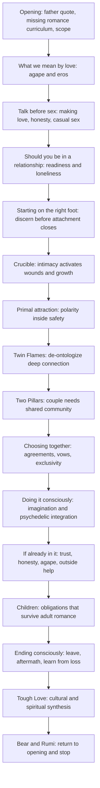
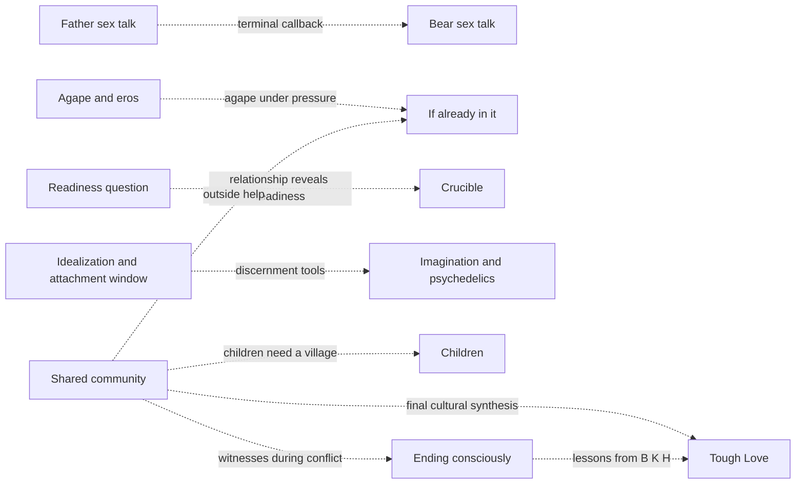
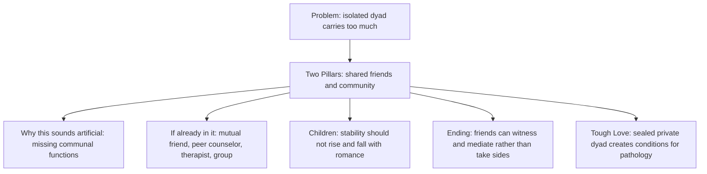
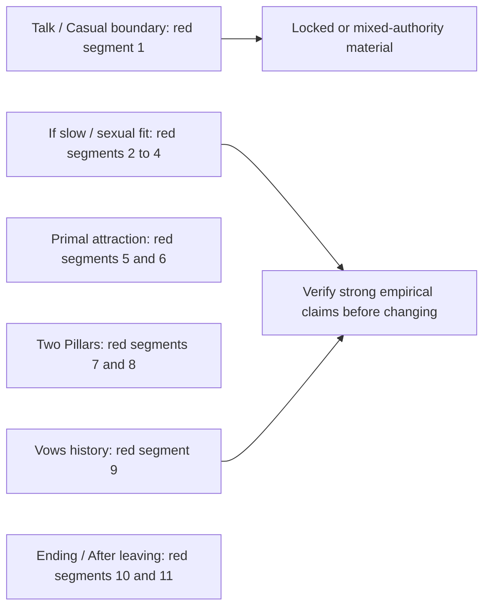

# Romance architecture map

<!-- article-id: romance -->

Indexes the current private Romance reconstruction. This graph is a visual recovery/control surface, not prose authority. Current explicit Joel corrections and the relevant `state/ROMANCE-*.md` records outrank the graph if a conflict is ever found.

Current materialized master: `work/romance-current-assembly/current-master.md` SHA-256 `4c3f58cb4e61eb8a194e0a183f3ec443e84155cdafc08124642ef68d98caeb5c`.
Current reader-visible boundary SHA-256: `99c803c7eda079582a8ba76b6524dcf726ece42e44e8f85796438b929594ea40` (18,357 words).
Whole-article cold-audit record: `state/ROMANCE-CURRENT-MASTER-COLD-AUDIT-2026-08-16.md`.
Whole-article Pangram overlay: `state/ROMANCE-WHOLE-ARTICLE-PANGRAM-OVERLAY-2026-08-16.md` — 92.998% Human / 7.002% AI / 0% AI-assisted, 11 High-confidence AI segments.

## Article overview

## Non-linear dependencies

## Community thread drill-down

## Current authority status

- **Opening:** Aug. 15 direct owner-final opening is materialized.
- **Doing it consciously / Psychedelics:** Aug. 16 approved boundary is materialized, including the sober long-term therapy test, delayed kind-conversation ritual, and current artificiality paragraph.
- **If you're already in it:** Aug. 16 direct owner-final rewrite is materialized; owner text SHA-256 `d513198739e921e81400f37bd5137ff5ba5635720cf10e87b1a95d41da110c16`; owner reports fully Human / High confidence.
- **Children:** current owner-final function is materialized: co-parenting responsibility, stepchildren continuity, never recruiting children into the adult war, the Bear custody/contact case, and the village return. The later reconstructed `Mommy and Daddy arguing` speech and `ordinary case / extreme exception` bridge are excluded from the master and remain provenance only.
- **Ending consciously:** the conversational owner-final Ending / After leaving / What I gained block remains in place. No child-speech relocation or older formal source was imported.
- **Tough Love:** corrected Aug. 16 direct owner-final section is materialized; owner text SHA-256 `ed0dd5037ca75523d3466ad9f26d21cd0aefa9f3a6532991c4e73009ac9185d8`; owner reports fully Human / High confidence.
- **Terminal close:** Bear/Rumi is inside current Tough Love and is the only terminal prose. Nothing follows it except the native Subscribe object.

## Final Pangram detector overlay

Detector status is secondary. These labels identify nodes to inspect; they do not authorize phrase-level edits or override locked/owner-final text.

- **Segment 1 — Talk → locked Casual Sex:** mixed-authority span. Diagnose the Talk portion separately; do not rewrite locked Casual merely because the detector window crosses the heading.
- **Segments 2–4 — If slow / sexual fit:** segment 2 includes Gandarussa efficacy/safety and requires factual verification before substantive change; segment 3 likely packs formal check-ins and co-parent fitness without a live-question connection; segment 4 likely overpacks sexual-fit caveats/aftercare.
- **Segments 5–6 — Primal:** inspect source provenance before changing the male/female symmetry or the `Not A Performance` symmetry; preserve genuine lived Bee material.
- **Segments 7–8 — Two Pillars:** strongest pure overcompletion candidates. One restates the thesis before the important qualification; the other may summarize the section after the practical payoff.
- **Segment 9 — Vows history:** historically specific and sweeping; verify before changing certainty or content.
- **Segments 10–11 — Ending / After leaving:** segment 10 crosses a heading, so split architecture functions before editing; segment 11 is a generalized instructional sequence and needs source recovery rather than wholesale paraphrase.

## Cold-audit disposition

- Community recurs deliberately because it performs different causal jobs at different nodes; do not deduplicate by noun overlap.
- H. recurs as different evidence at different nodes; do not collapse the cases automatically.
- The Children transition `Never recruit children into the adult war` → Ann/Bear case is intentionally direct; do not generate a bridge unless Joel asks for one.
- Largest retained recurrence: Rumi appears once in `What I gained from loss` and once in the final sentence. The first belongs to loss; the second is the current owner-final universal/terminal close. Retain unless Joel chooses a single Rumi use or a later coherent revision changes this deliberately.

## Protected placement rules

1. Do not move or delete a section merely because a nearby detector span is red. Check this map and the article-wide architecture first.
2. A section may recur around the same person or concept when it performs a different job. Inspect the labeled function before calling it duplication.
3. Before deleting or relocating prose, identify every job/dependency it carries and where each job will land. If one becomes orphaned, the edit is blocked.
4. When Joel supplies a new owner-final section, update this map in the same change that updates the assembly spec/replacement file.
5. The map must represent the intended current article, while `current-master.md` and its manifest prove what has actually been materialized. A mismatch is explicit assembly drift to repair, never permission to reinterpret authority.
6. A surviving older source is not automatically current owner-final prose. Use it to recover protected thought/functions, but prefer later direct Joel rewrites and recorded locks.
7. A detector segment that crosses a heading or authority boundary must be split by article function before any rewrite.

## Current next step

Inspect source/provenance for the red nodes and repair only genuine semantic/coherence weaknesses. Prioritize Two Pillars and the `If slow` thought-sequencing spans before detector research. Verify Gandarussa and vows-history claims before any substantive claim change. Reassemble and cold-audit coherent edits before spending another Pangram call.
