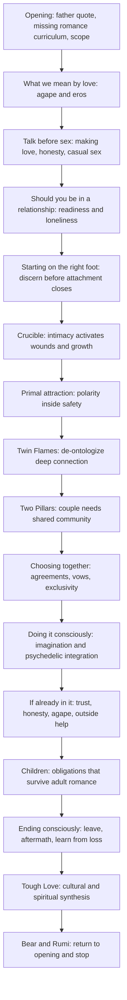
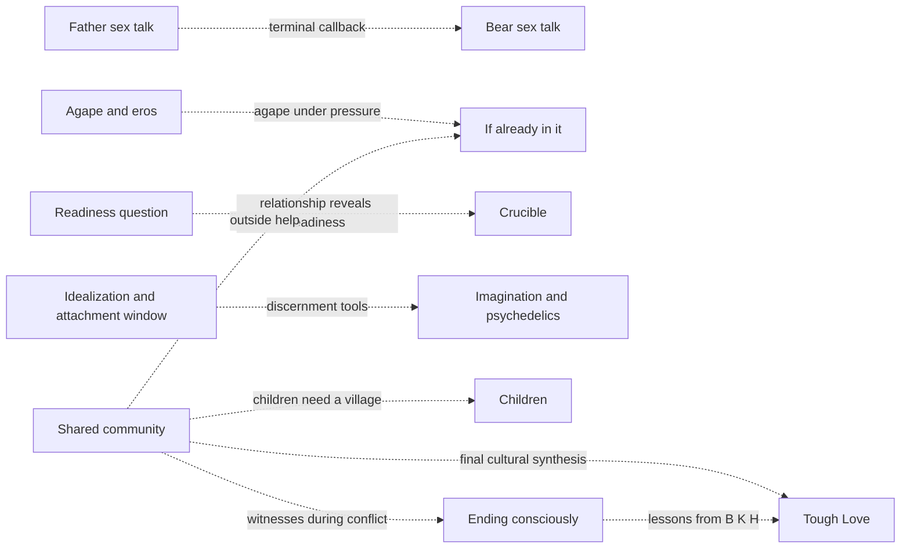
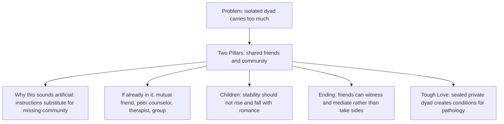

# Romance architecture map

<!-- article-id: romance -->

Indexes the private Romance reconstruction currently assembled from the Aug. 13 baseline plus later owner-final replacements. This graph is a visual recovery/control surface, not prose authority. Current explicit Joel corrections and the relevant `state/ROMANCE-*.md` records outrank stale materialized bytes.

## Article overview

## Non-linear dependencies

## Community thread drill-down

## Current authority and assembly drift

- **Opening:** Aug. 15 direct owner-final opening; current PR #32 replacement is authoritative for this node.
- **Psychedelics:** Aug. 16 owner-approved integration adds the sober long-term test for therapy and the delayed kind-conversation ritual. The current PR #32 materialized master is stale here.
- **If you're already in it:** Aug. 16 direct owner-final rewrite, SHA-256 `d513198739e921e81400f37bd5137ff5ba5635720cf10e87b1a95d41da110c16`, owner-reported fully Human / High confidence. The current PR #32 materialized master is stale here.
- **Children / Ending consciously:** preserve the owner-final functional split. Children owns co-parenting responsibility, stepchildren, Bear custody history, and village logic. Child-facing breakup communication belongs with the owner-final ending sequence rather than being used as an assistant-created expansion of Children. PR #32 must be reconciled against the controlling owner-final source before final assembly.
- **Tough Love:** Aug. 16 corrected direct owner-final section, SHA-256 `ed0dd5037ca75523d3466ad9f26d21cd0aefa9f3a6532991c4e73009ac9185d8`, owner-reported fully Human / High confidence. The current PR #32 materialized master is stale here.
- **Terminal close:** Bear/Rumi is now inside the current owner-final Tough Love section and is the only terminal prose. Nothing follows it except the native Subscribe object.

## Protected placement rules

1. Do not move or delete a section merely because a nearby detector span is red. Check this map and the article-wide architecture first.
2. A section may recur around the same person or concept when it performs a different job. H. in casual/situationship, community, loss, and Tough Love is not automatically duplication; inspect the labeled function.
3. Before deleting or relocating prose, identify every job/dependency it carries and where each job will land. If one becomes orphaned, the edit is blocked.
4. When Joel supplies a new owner-final section, update this map in the same change that updates the assembly spec/replacement file.
5. The map must represent the intended current article, while `current-master.md` and its manifest record what has actually been materialized. Any mismatch is explicit assembly drift to repair, never a reason to silently reinterpret authority.

## Current next step

Reconcile PR #32's assembly operations against this map: update Psychedelics, `If you're already in it`, Children/Ending placement, and complete Tough Love; regenerate `current-master.md` and reader-visible boundary; then run two whole-article cold audits before the final Pangram call.
