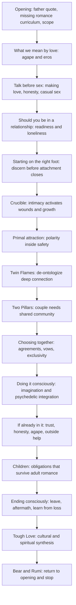
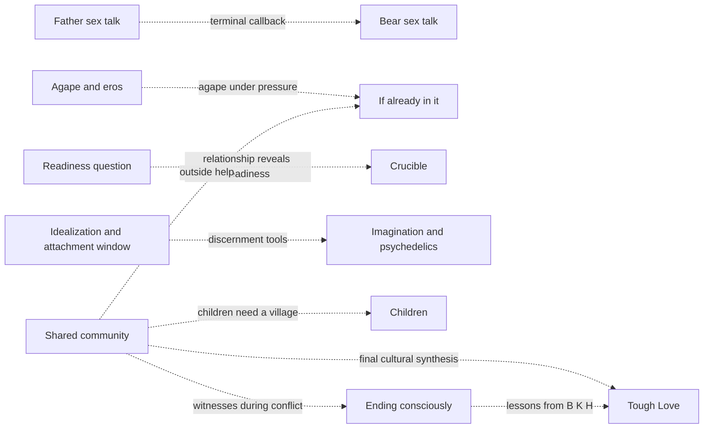
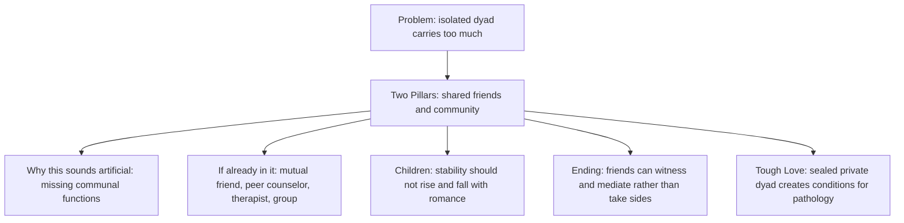
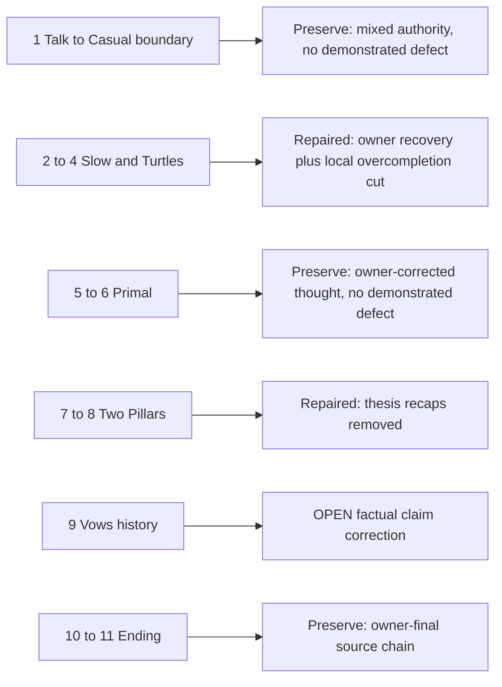

# Romance architecture map

<!-- article-id: romance -->

Indexes the current private Romance reconstruction. This graph is a visual recovery/control surface, not prose authority. Current explicit Joel corrections and the relevant `state/ROMANCE-*.md` records outrank the graph if a conflict is ever found.

Current materialized master: `work/romance-current-assembly/current-master.md` SHA-256 `d4dd760c9b7b970b03a9f5587fd8c09f23d3d3d5cbd40f291b521d3e69f9b028`.
Current reader-visible boundary SHA-256: `fd47cad5825ab8f3bafd810c4c0b7e0a817edff40bd802edf66dac7247b6412e` (18,248 words).
Whole-article Pangram overlay for the prior 18,357-word boundary: `state/ROMANCE-WHOLE-ARTICLE-PANGRAM-OVERLAY-2026-08-16.md` — 92.998% Human / 7.002% AI / 0% AI-assisted, 11 High-confidence AI segments.

## Article overview

## Non-linear dependencies

## Community thread drill-down

## Current authority status

- **Opening:** Aug. 15 direct owner-final opening is materialized.
- **Doing it consciously / Psychedelics:** Aug. 16 approved boundary is materialized.
- **If you're already in it:** Aug. 16 direct owner-final rewrite is materialized and owner-reported fully Human / High confidence.
- **Children:** current owner-final co-parenting / stepchildren / Bear / village function is materialized; reconstruction-only child speech is excluded.
- **Ending consciously / After leaving / What I gained:** direct owner-final source chain, previously owner-reported all green. Preserve unless a genuine semantic/factual defect is found.
- **Primal attraction:** manually owner-corrected architecture and claims. Some exact Desire wording was assistant-realized, but current section was owner-reviewed. Preserve Bee/Key material, gendered wanting distinction, invitational leadership, non-performance claim, Fantasy, and cervical/whole-body culmination unless a real thought defect emerges.
- **Tough Love:** corrected Aug. 16 direct owner-final section is materialized and owner-reported fully Human / High confidence.
- **Terminal close:** Bear/Rumi is the only terminal prose before Subscribe.

## Post-Pangram repair/disposition overlay

The 11 red segments came from the prior reader-visible SHA `99c803c7eda079582a8ba76b6524dcf726ece42e44e8f85796438b929594ea40`; they are not labels on the current boundary.

### 1 — Talk / Casual
No change. The segment crossed from current Talk into locked Casual. Talk's section-call budget was already exhausted during Aug. 15 recovery, and no live coherence defect requires rewriting it.

### 2–4 — Slow / Turtles
Repaired for fidelity and flow.
- Restored `If slow isn’t realistic for you` from the Aug. 14 owner-recovery r27 source pool, previously 100% Human on Pangram 4. This restores Joel's lived mechanism: he intends to wait; women generally initiate; in the moment he wants to please; masturbation is a weak workaround because he usually is not initiating and his refractory period is short; avoiding private heat-of-the-moment situations is the main strategy.
- Restored the scoped Twin-Flame question, one-dimensionalizing-women insight, attachment-generated certainty problem, and deliberate check-ins after entanglement.
- Restored the less aggressive Gandarussa wording instead of the later `works better than condoms` formulation. **Accuracy remains open:** accessible evidence does not establish contraceptive efficacy, so `looks quite effective` still needs an owner/source decision before publication.
- `Turtles` removes only generic `tomorrow’s not a given and every situation is unique` and meta `That conversation is hard because`; the sexual-fit caveat, `Let’s just be friends!` joke, and universal-love/romance distinction remain.

### 5–6 — Primal
No change. Source recovery confirms the intended topology: safety/closeness → Muses/Directors and role flexibility → gendered desire channels → Not A Performance/invitational enactment → Fantasy → cervical/whole-body culmination. Historical detector work also moved its red boundary among abstract symmetry blocks while personal/embodied material remained Human. No semantic defect now justifies overwriting owner-reviewed prose solely to reduce detector symmetry.

### 7–8 — Two Pillars
Repaired for overcompletion.
- Deleted `Romantic love can last, but it needs the right conditions...` because the section had already demonstrated the thesis.
- Deleted `Community isn’t magic either.` and let the qualification speak directly.
- Reduced the final recap to its one unique claim: `I do think romantic love can last for a lifetime.`

### 9 — Vows / monogamy history
**OPEN factual blocker.** Current prose compresses agriculture, property/inheritance, socially enforced monogamy, the Industrial Revolution, hunter-gatherer marriage, and flexible outside sexual/emotional connection into a historical story that is too simple for the evidence. Do not silently rewrite Joel's argument; resolve the factual formulation with him.

### 10–11 — Ending / After leaving
No change. Source recovery confirms `Ending consciously / After leaving / What I gained` was owner-final and previously all-green. The detector segment crosses the `After leaving` heading. The reconstruction map explicitly preserves the truth-without-prosecution → new sight → perspective without forced innocence → less-invested witness → spiritual practice without bypass → apology/recontact sequence. Detector red is contextual evidence, not authority to replace it.

## Accuracy blockers before final certification

1. **Gandarussa:** current restored r27 sentence says the evidence ranges and nothing is 100% proven but it `looks quite effective`. Accessible current evidence describes it as experimental/Phase II and does not establish contraceptive efficacy. Need Joel either to supply the evidence he is relying on or authorize a more cautious formulation.
2. **Marriage / monogamy history:** current attraction/exclusivity paragraph is materially oversimplified and needs an owner-authorized factual rewrite.

## Protected placement rules

1. Do not move or delete a section merely because a nearby detector span is red. Check this map and article-wide architecture first.
2. Repeated people/concepts are not duplication when they perform different jobs.
3. Before deleting or relocating prose, identify every job/dependency and destination; orphaned function blocks the edit.
4. New owner-final topology must update this map in the same change as assembly authority.
5. A mismatch between this map and materialized master is explicit assembly drift, not permission to reinterpret authority.
6. Older surviving source is not automatically current owner-final prose; current owner correction controls.
7. A detector segment crossing a heading/authority boundary must be split by article function before rewrite.

## Current next step

Resolve Gandarussa and the marriage/monogamy-history paragraph. Then reassemble, run the two whole-article cold audits against this map, and only then spend another exact whole-article Pangram call. Do not spend section-level calls on unchanged Talk, Primal, or Ending merely to reproduce old green results.
