# Romance architecture map

<!-- article-id: romance -->

Indexes the current private Romance reconstruction. This graph is a visual recovery/control surface, not prose authority. Current explicit Joel corrections and the relevant `state/ROMANCE-*.md` records outrank the graph if a conflict is ever found.

Current materialized master: `work/romance-current-assembly/current-master.md` SHA-256 `2728c77308698e8f217a5579056ece2526b627c860ed2dafbf33c44ab790d8eb`.
Current reader-visible boundary SHA-256: `32c2e69a5bc4c3b7760aab27ba690fb19ef5a98d446ed1f02dbbefb739a151cb` (**20,612 words**).
Current integrated-source audit: `state/ROMANCE-TOFT-ANAMI-INTEGRATION-COLD-AUDIT-2026-08-17.md`.
Current source pool: `state/ROMANCE-TOFT-ANAMI-OWNER-SOURCE-POOL-2026-08-17.md`.
Current concept audit: `state/ROMANCE-CONCEPT-SETUP-AUDIT-2026-08-17.md`.
Current whole-article cold audit: `state/ROMANCE-CONCEPT-FLOW-COLD-AUDIT-2026-08-17.md`.
Current owner-order Primal audit: `state/ROMANCE-PRIMAL-OWNER-ORDER-COLD-AUDIT-2026-08-17.md`.

## Article overview

```mermaid
flowchart TD
    opening["Opening: father quote, missing romance curriculum, scope"]
    love["Love: agape + eros; durability when attraction changes"]
    talk["Talk before sex: honesty + affection/simmer + sexual responsibility"]
    should["Readiness + practical motives + provider/protector desire vs durable love"]
    find["Find a partner: community observation + missing courtship middle"]
    starting["Starting right: discern before attachment closes; sexual fit can develop"]
    crucible["Crucible: intimacy as spiritual practice; wounds; coercion exits mutual path"]
    maturity["Maturity: role-play vs role-capture; complementarity without permanent caregiving"]
    primal["Primal: polarity inside safety + sacred making love + poetic/prosaic modes"]
    twin["Twin Flames: de-ontologize deep connection"]
    pillars["Two Pillars: couple needs shared community"]
    choosing["Choosing together: labels, agreements, vows, exclusivity"]
    conscious["Doing it consciously: imagination + psychedelic integration"]
    already["If already in it: trust, honesty, agape, outside help"]
    children["Children: obligations that survive adult romance"]
    ending["Ending consciously: leave, aftermath, learn from loss"]
    tough["Tough Love: cultural and spiritual synthesis"]
    bear["Bear and Rumi: return to opening and stop"]

    opening --> love --> talk --> should --> find --> starting --> crucible --> maturity --> primal --> twin --> pillars --> choosing --> conscious --> already --> children --> ending --> tough --> bear
```

## Non-linear dependencies

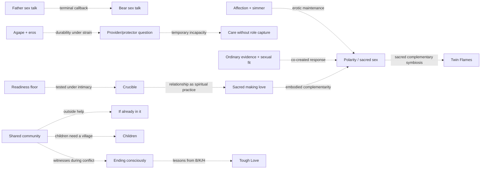

## Conversation cards -> lived evidence

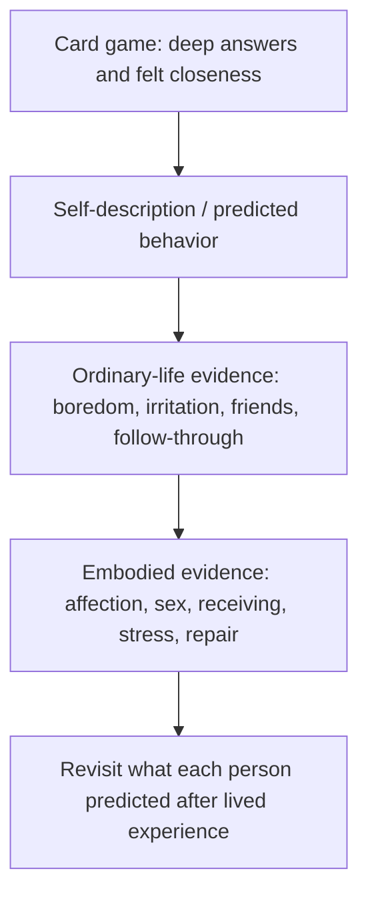

**Control:** a game can produce real closeness without proving compatibility. Questions should increasingly lead to ordinary observation, a reality experiment, or a later revisit rather than merely generating more self-description.

## Affection -> simmer -> sex as barometer

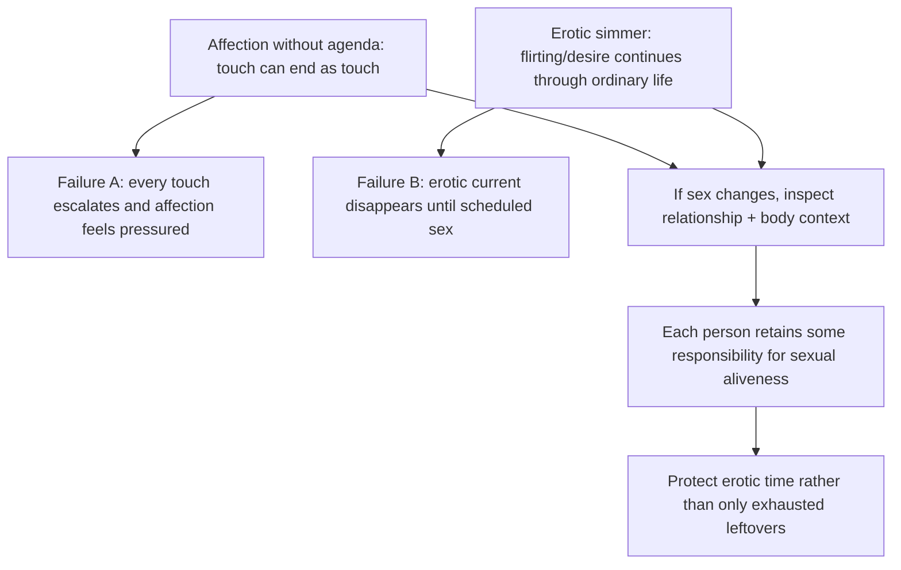

**Control:** Toft and Anami are complementary here, not competing doctrines. The article does not claim missing flirtation mechanically causes bad sex or that every affectionate touch should be sexual.

## Readiness -> provider/protector desire -> durable love

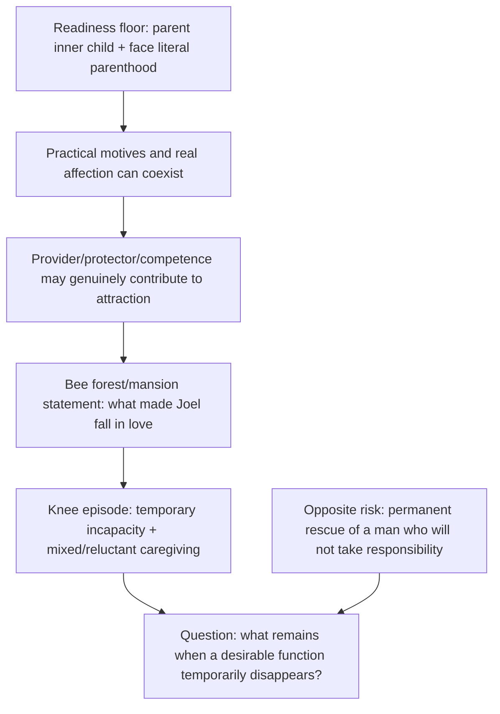

**Control:** do not flatten the thought into `provision should not matter`. Attraction can partly depend on function. The live question is whether love grows broader than the trait/function that first helped create desire. The knee memory remains mixed evidence, not sentimental proof of devotion.

## Missing courtship middle -> sexual compatibility has two directions

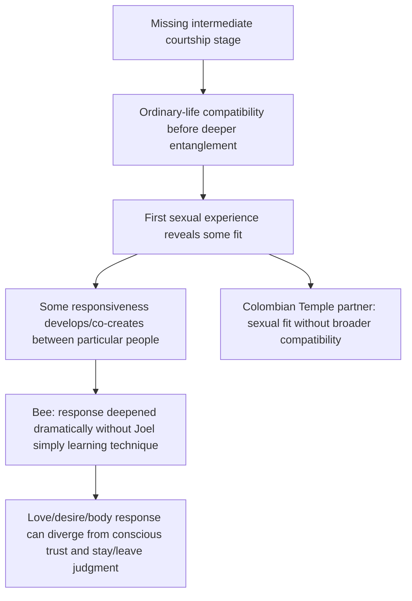

**Control:** `trainable` is too simple. The article also does not infer from Bee's sexual response that she should have remained in the marriage. Body response, love, conscious trust, and the decision to stay can move differently.

## Idealization -> healthy-adult evidence -> flaws -> Crucible

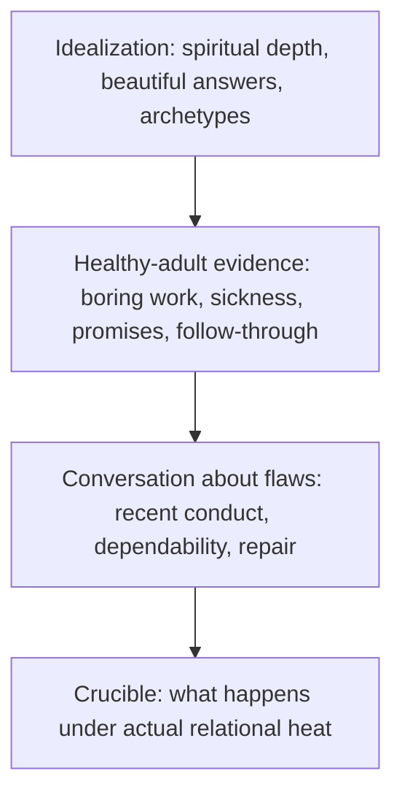

**Control:** spiritual depth may be real without establishing dependability. The Crucible attribution now uses Schnarch's differentiation / people-growing-process framing rather than caricaturing all couples therapy.

## Crucible: spiritual practice + mutual activation versus coercion

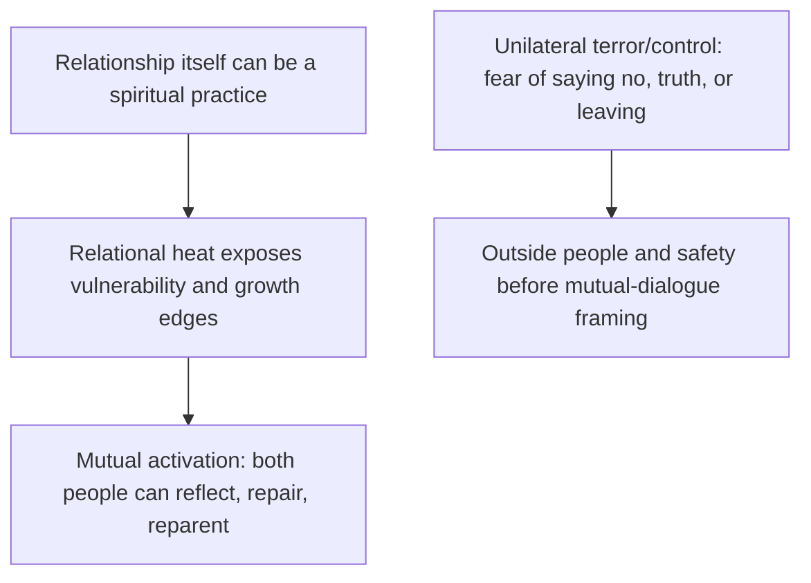

**Control:** Toft's fifty-year-marriage observation strengthens the existing Crucible claim rather than creating a separate doctrine. Coercion is not a hotter version of the mutual Crucible; it exits the mutual-communication path.

## Maturity: role-play versus role capture

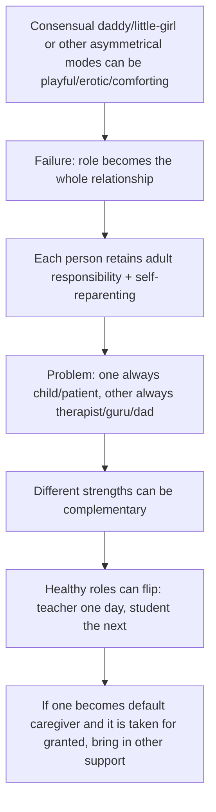

**Control:** the article does not deny consensual role-play merely because permanent parent/child organization is unhealthy. The prior redundant reparenting recap remains deleted.

## Primal attraction: owner route + sacred-making-love branch

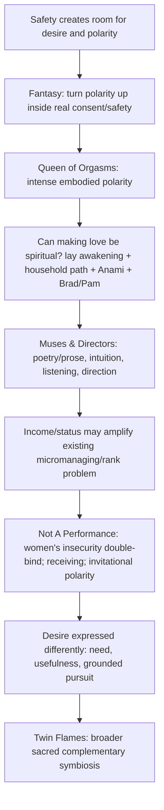

**Controls:**
- Recovered owner subsection order remains Fantasy → Queen → Muses → Not A Performance → Desire; the newly authorized sacred-making-love subsection sits between Queen and Muses because it grows directly out of the embodied-sex question.
- Existing Queen evidence prose is unchanged after Joel rejected an unnecessary evidentiary disclaimer.
- The Brad/Pam YouTube object `Li--FKwJu0Q` is a new authorized native object and sits after their self-report, before the section's synthesis.
- `Women are poetry and men are prose` is explicitly a masculine/feminine mode formulation, not a claim that every individual matches the average.
- Toft/Mars-Venus listening guidance applies pragmatically to both sexes; the question `solve or listen?` avoids making the average a law.
- Emotional intensity never licenses intimidation, lies, false accusations, or fear.
- The female-earnings idea is not a new `boss babe` doctrine. It extends the already-existing micromanaging / `Let me do it` / invitational-polarity movement. Female success is not itself the problem; rank/control can be.
- A successful woman need not shrink herself to protect a man's identity.

## Sacred making love: unequal source roles

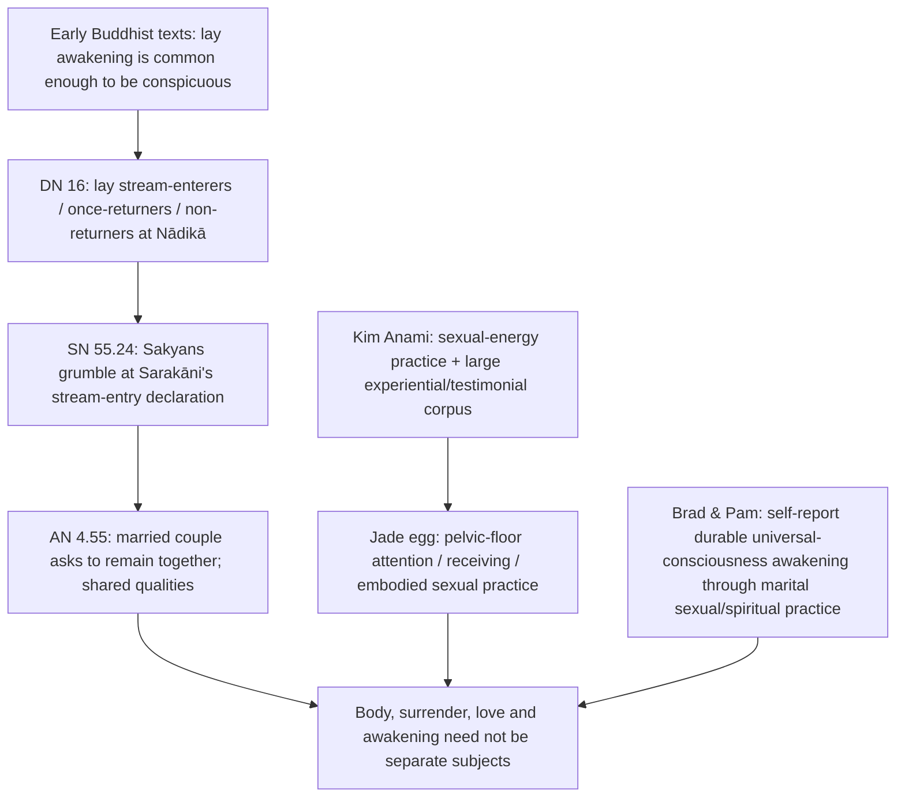

**Control:** the article does not claim the early Buddha taught tantric/cervical sex. Sarakāni is not used to argue that habitual intoxication is compatible with stream entry; the alcohol dispute is deliberately not made the point. Brad/Pam's attainment language remains their report/interpretation, not externally certified attainment.

## Labels -> shared meaning -> agreements -> vows

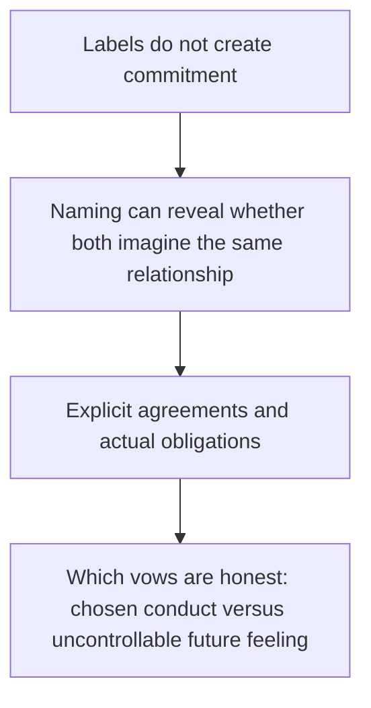

**Control:** no Toft paragraph was added merely to say people change; the existing vows architecture already carries that function.

## Community: seed -> primary home -> applications

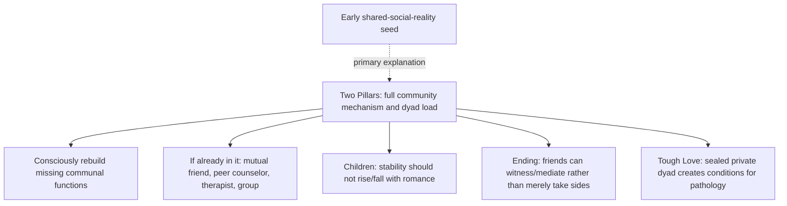

## Psychedelic intimacy -> warning -> state-dependent learning -> sober evidence

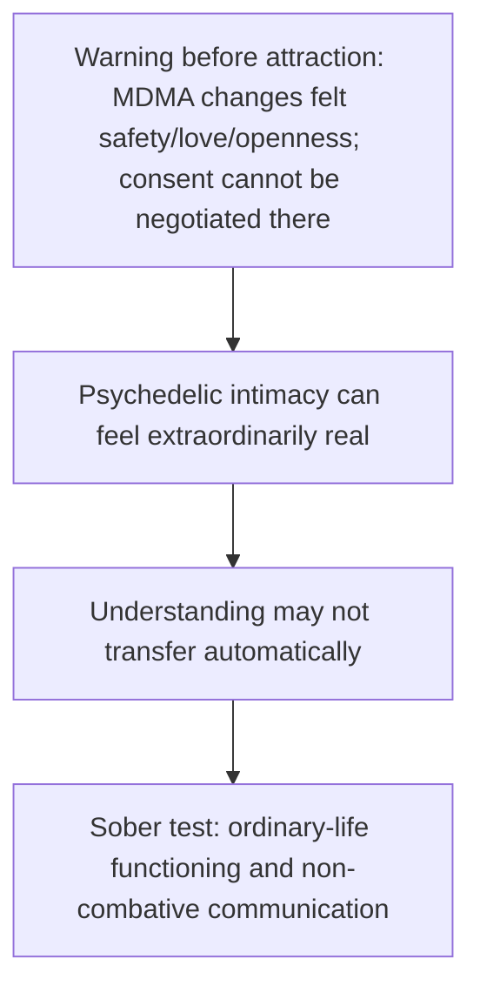

**Control:** Toft's break/stay-connected advice was not duplicated because the existing communication/MDMA material already carries that function.

## Current authority / provenance status

- **Opening / Love:** owner-controlled and unchanged in this pass.
- **Talk:** existing sex conversation remains; Toft touch-without-agenda and Anami simmer/barometer/self-responsibility/protected-time material is newly integrated. Toft is explicitly credited and linked once.
- **Should you be in a relationship:** owner memories control the provider/protector question, Bee forest/mansion trigger, mixed knee-care episode, and fixer counterexample.
- **Starting right / Turtles:** owner memories control Bee sexual-development account and the Colombian Temple relationship. Assistant language supplies connective syntax; no claim that Bee's body proved the marriage should continue.
- **Crucible:** owner-approved Schnarch correction is materialized; Toft relationship-as-spiritual-practice line is an outside experiential support.
- **Don't make partner whole world:** Toft outside sources of feminine energy added once; duplicate sexual-self-responsibility paragraph removed in cold audit.
- **Maturity:** owner qualification controls daddy/little-girl role-play versus permanent role-capture distinction.
- **Primal:** recovered owner subsection order preserved. New sacred-making-love subsection is authorized owner thought using Buddhist primary texts, Anami experiential/testimonial material, and Brad/Pam self-report. Queen prose unchanged.
- **Muses / Not A Performance:** owner poetry/prose formulation, female-insecurity thread, and income/rank thought integrated into existing owner polarity architecture. No separate boss-babe section.
- **Vows / psychedelics / Ending / Children / Tough Love / Bear close:** no new substantive changes in this pass.

## Detector evidence and status

The current **20,612-word** reader-visible boundary has **not** been Pangram tested and must not inherit labels from earlier topology.

Current exact halves:
- Part 1: **10,332 words**, SHA-256 `3e137394f3f1694ba69069f30bfebc9afecb8540a4472e3b5532b8f11de92f54`.
- Part 2: **10,280 words**, SHA-256 `9016139e285e0246bd5c8fdc4545005a294b0e7dfff79dbe9104df073cb1444d`.

The last completed manual GUI scan was the older 18,748-word boundary (94.4% Human Part 1; 94.1% Human Part 2). It is historical localization evidence only. The current topology adds approximately 1.9k words and a new native video, so detector localization must start from the new exact hashes.

## Protected placement / semantic rules

1. Meaning, reality, owner authority and architecture outrank detector output.
2. Do not move/delete a section merely because a detector window is red.
3. Repeated people/concepts are not duplication when they perform different jobs; repeated explanation with the same job is cut.
4. Before deleting/relocating prose, identify every function and destination.
5. Native-object identity and source position are protected; the new Brad/Pam video is authorized exactly in the sacred-sex subsection.
6. The readiness floor remains categorical; later maturity standards vary only above it.
7. The Bee door event remains a lie; explanatory context cannot erase the behavior.
8. The forest/mansion statement is what made Joel fall in love with Bee; do not downgrade it to merely reassuring or memorable.
9. Bee's knee care remains mixed/reluctant; do not romanticize it into uncomplicated devotion.
10. Sexual responsiveness can develop between particular people; do not collapse this into generic `trainability` or imply body response dictates stay/leave judgment.
11. Income/status is an example inside existing polarity/control architecture, not a standalone anti-success doctrine.
12. Emotional intensity / poetic mode never excuses coercion, false claims, intimidation, or abandonment of reality.
13. Do not insert the unverified `~20% vaginal tightening physiology` number.
14. Do not use Sarakāni to imply habitual intoxication is compatible with stream entry.
15. Do not add another vows/people-change paragraph.
16. Do not duplicate break/reconnect advice already carried in the MDMA/communication material.
17. Use the least qualification necessary; assume intelligent readers and avoid defensive aftercare.
18. Do not invent calendar/day/time/scenery details to make prose look human.

## Current next step

Editorial integration is locked enough for the new exact-boundary detector scan. Run Pangram only against the current 20,612-word hashes after the Browserbase GUI path is live-certified or by manual GUI/PDF if needed. Any detector repair must begin with semantic/architecture review of the exact localized span rather than stylistic rewriting by default.
