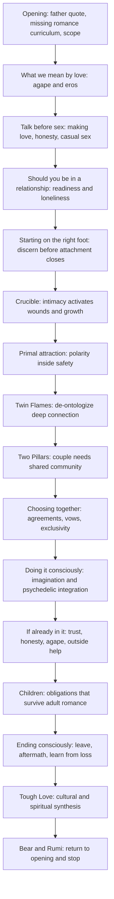
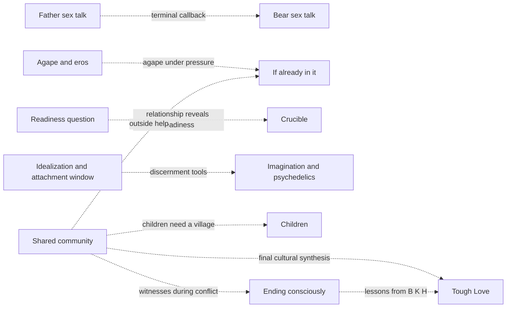
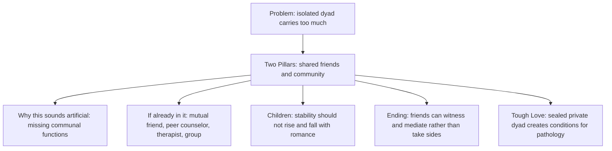
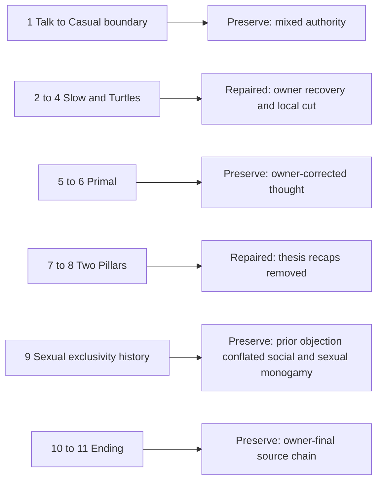

# Romance architecture map

<!-- article-id: romance -->

Indexes the current private Romance reconstruction. This graph is a visual recovery/control surface, not prose authority. Current explicit Joel corrections and the relevant `state/ROMANCE-*.md` records outrank the graph if a conflict is ever found.

Current materialized master: `work/romance-current-assembly/current-master.md` SHA-256 `dbbc02fde8330045a945a45d51b12d87ed386167958e7c9870852caf51c479ff`.
Current reader-visible boundary SHA-256: `fd47cad5825ab8f3bafd810c4c0b7e0a817edff40bd802edf66dac7247b6412e` (18,248 words).
Current whole-article cold audit: `state/ROMANCE-POST-PANGRAM-REPAIR-COLD-AUDIT-2026-08-16.md`.
Final certification credit-block record: `state/ROMANCE-FINAL-PANGRAM-R3-CREDIT-BLOCK-2026-08-16.md`.
Whole-article Pangram overlay for the earlier 18,357-word boundary: `state/ROMANCE-WHOLE-ARTICLE-PANGRAM-OVERLAY-2026-08-16.md` — 92.998% Human / 7.002% AI / 0% AI-assisted, 11 High-confidence AI segments.

## Article overview

## Non-linear dependencies

## Community thread drill-down

## Current authority status

- **Opening:** Aug. 15 direct owner-final opening is materialized.
- **Doing it consciously / Psychedelics:** Aug. 16 approved boundary is materialized.
- **If you're already in it:** Aug. 16 direct owner-final rewrite is materialized and owner-reported fully Human / High confidence.
- **Children:** current owner-final co-parenting / stepchildren / Bear / village function is materialized; reconstruction-only child speech is excluded.
- **Ending consciously / After leaving / What I gained:** direct owner-final source chain, previously owner-reported all green. Preserve unless a genuine semantic/factual defect is found.
- **Primal attraction:** manually owner-corrected architecture and claims. Some exact Desire wording was assistant-realized, but current section was owner-reviewed. Preserve unless a real thought defect emerges.
- **Tough Love:** corrected Aug. 16 direct owner-final section is materialized and owner-reported fully Human / High confidence.
- **Terminal close:** Bear/Rumi is the only terminal prose before Subscribe.

## Post-Pangram repair/disposition overlay

The 11 red segments came from the prior reader-visible SHA `99c803c7eda079582a8ba76b6524dcf726ece42e44e8f85796438b929594ea40`; they are not labels on the current boundary.

### Talk / Casual
No change. Detector segment crossed from current Talk into locked Casual; no live coherence defect requires rewriting it.

### Slow / Turtles
Repaired for fidelity and flow.
- `If slow isn’t realistic for you` is restored from the Aug. 14 owner-recovery r27 source pool, previously 100% Human on Pangram 4.
- Owner-final Gandarussa wording is retained exactly. `Gandarussa` now links to Mark Wilson, `A Male Contraceptive Pill for Indonesia?`, *The Diplomat* (2013), which reports Prajogo's >20-year research program, clinical trials beginning in 2008, >500 male participants, one reported pregnancy, few reported side effects, and reported return of fertility after one month off treatment. The link is offered so readers can inspect the evidence; do not replace Joel's wording with assistant-generated risk language.
- Separate anti-HIV evidence exists, but it is not being inserted into this contraception paragraph. Published work reports in-vitro anti-HIV activity from *J. gendarussa* extracts/constituents. Do not translate this into a clinical HIV-treatment claim without a separate owner decision.
- `Turtles` removes only generic/meta aftercare; substantive sex-fit claims remain.

### Primal
No change. The intended topology remains safety/closeness → Muses/Directors and role flexibility → gendered desire channels → Not A Performance → Fantasy → cervical/whole-body culmination. Detector symmetry alone is not a semantic defect.

### Two Pillars
Repaired for overcompletion: thesis recap and generic `Community isn’t magic either` framing removed; final close reduced to the unique lifetime-love claim.

### Sexual exclusivity history
**Previous assistant factual objection withdrawn.** It conflated socially monogamous marriage/pair-bonding with sexual monogamy. The article explicitly distinguishes them. Evidence that one-spouse marriage or long-term pair bonds are ancient does not rebut the history of strict sexual exclusivity.

Relevant evidence supports keeping the distinction visible:
- ancient Rome could impose monogamous marriage while permitting male extramarital sex;
- cross-cultural work reports substantial extra-pair sex within socially recognized pair bonds, including formally or informally sanctioned arrangements in some societies;
- partible-paternity systems in lowland South America can institutionalize multiple sexual partners/cofathers within primary social relationships;
- modern ethnographic work explicitly warns against assuming the Western companionate-marriage ideal of marital sexual fidelity is universal.

The current paragraph remains owner-controlled and is not to be replaced by analysis of social monogamy. A future source-linking pass may add citations specifically about sexual exclusivity if useful, but no substantive rewrite is authorized by the prior research.

### Ending / After leaving
No change. Owner-final and previously all-green; detector segment crossed the heading and does not justify replacing the chain.

## Final certification status

The current 18,248-word boundary passed the two whole-article cold audits and was registered as experiment `romance-current-master-visible-final-r3-2026-08-16`.

Workflow run `31952964278` passed its verification job (`95179183840`) but the detector job (`95179214894`) received Pangram HTTP 402 `Insufficient credits` at task submission. The runner durably recorded both the call reservation and submit failure. No r3 result file exists, and no final detector classification was obtained.

Do not register another experiment or duplicate the request. Once credits are replenished, confirm the r3 result file still does not exist and re-run failed detector job `95179214894` (or failed jobs for run `31952964278`).

## Protected placement rules

1. Do not move or delete a section merely because a nearby detector span is red. Check this map and article-wide architecture first.
2. Repeated people/concepts are not duplication when they perform different jobs.
3. Before deleting or relocating prose, identify every job/dependency and destination; orphaned function blocks the edit.
4. New owner-final topology must update this map in the same change as assembly authority.
5. A mismatch between this map and materialized master is explicit assembly drift, not permission to reinterpret authority.
6. Older surviving source is not automatically current owner-final prose; current owner correction controls.
7. A detector segment crossing a heading/authority boundary must be split by article function before rewrite.
8. Do not substitute evidence about **social monogamy** for evidence about **sexual monogamy / sexual exclusivity**.

## Current next step

Replenish Pangram credits, confirm no r3 result exists, then re-run failed detector job `95179214894`. Inspect the resulting exact-boundary evidence before any further editorial action. No further prose change is currently justified while certification is credit-blocked.
