# Romance architecture map

<!-- article-id: romance -->

Indexes the current private Romance reconstruction. This graph is a visual recovery/control surface, not prose authority. Current explicit Joel corrections and the relevant `state/ROMANCE-*.md` records outrank the graph if a conflict is ever found.

Current materialized master: `work/romance-current-assembly/current-master.md` SHA-256 `02ea7fec6bebbc6f28f6082dba7357d82de574eff431dfb5342429bcb3438ad1`.
Current reader-visible boundary SHA-256: `6cb3eaa6283281c46657450988b69fbde9449a018d616a360649cf718e55803c` (18,705 words).
Current concept audit: `state/ROMANCE-CONCEPT-SETUP-AUDIT-2026-08-17.md`.
Current whole-article cold audit: `state/ROMANCE-CONCEPT-FLOW-COLD-AUDIT-2026-08-17.md`.
Current owner-order Primal audit: `state/ROMANCE-PRIMAL-OWNER-ORDER-COLD-AUDIT-2026-08-17.md`.
Current prose-change ledger: `state/ROMANCE-CONCEPT-FLOW-PROSE-CHANGE-LEDGER-2026-08-17.md`.
Current task state: `state/ROMANCE-CONCEPT-FLOW-CURRENT-STATE-2026-08-17.md`.

## Article overview

```mermaid
flowchart TD
    opening["Opening: father quote, missing romance curriculum, scope"]
    love["What we mean by love: agape and eros"]
    talk["Talk before sex: making love, honesty, casual sex"]
    should["Should you be in a relationship: categorical readiness and loneliness"]
    find["How to find a partner: community observation and missing courtship middle"]
    starting["Starting on the right foot: discern before attachment closes"]
    crucible["Crucible: intimacy activates wounds; coercion is a separate safety case"]
    primal["Primal attraction: polarity inside safety"]
    twin["Twin Flames: de-ontologize deep connection"]
    pillars["Two Pillars: couple needs shared community"]
    choosing["Choosing together: labels, agreements, vows, exclusivity"]
    conscious["Doing it consciously: imagination and psychedelic integration"]
    already["If already in it: trust, honesty, agape, outside help"]
    children["Children: obligations that survive adult romance"]
    ending["Ending consciously: leave, aftermath, learn from loss"]
    tough["Tough Love: cultural and spiritual synthesis"]
    bear["Bear and Rumi: return to opening and stop"]

    opening --> love --> talk --> should --> find --> starting --> crucible --> primal --> twin --> pillars --> choosing --> conscious --> already --> children --> ending --> tough --> bear
```

## Non-linear dependencies

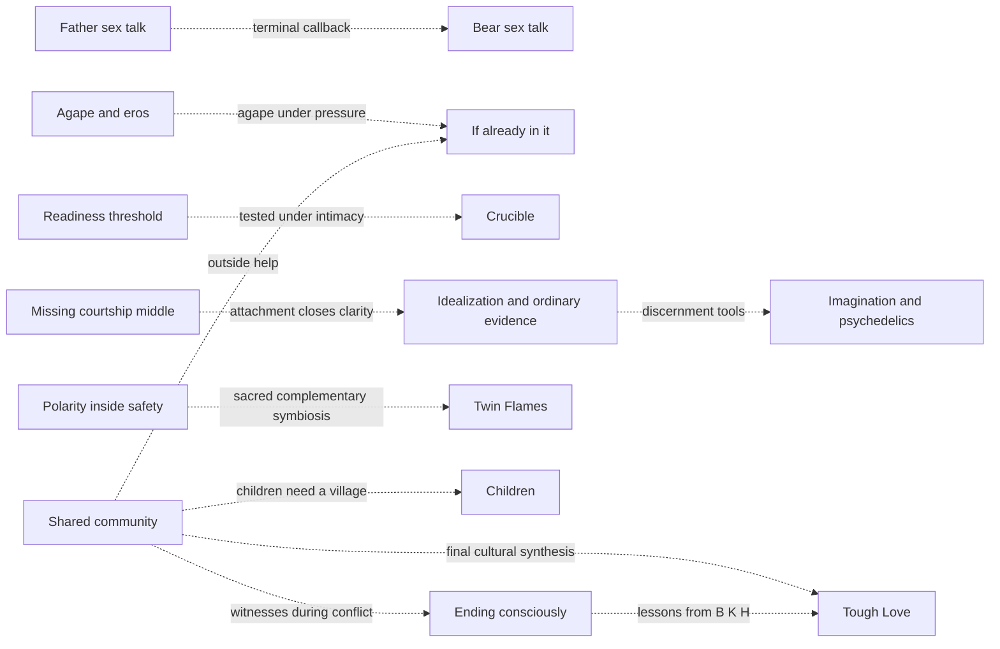

## Card-game intimacy -> lived evidence

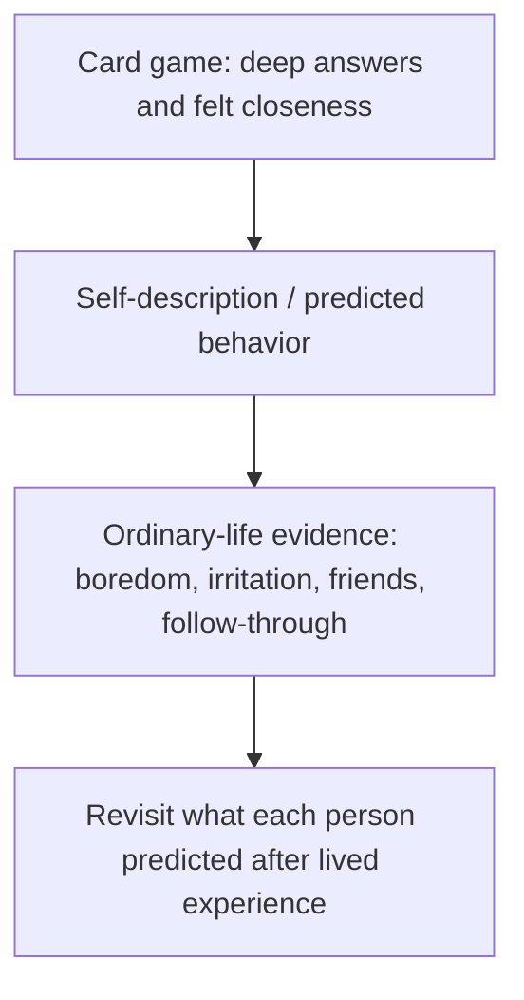

**Control:** the game can produce real closeness and still only establish that the conversation worked. The primary evidence shift is from what someone says about themself to what ordinary life reveals. The later agreements/card-game passage is a callback, not a second primary explanation.

## Readiness -> missing intermediate stage -> entanglement

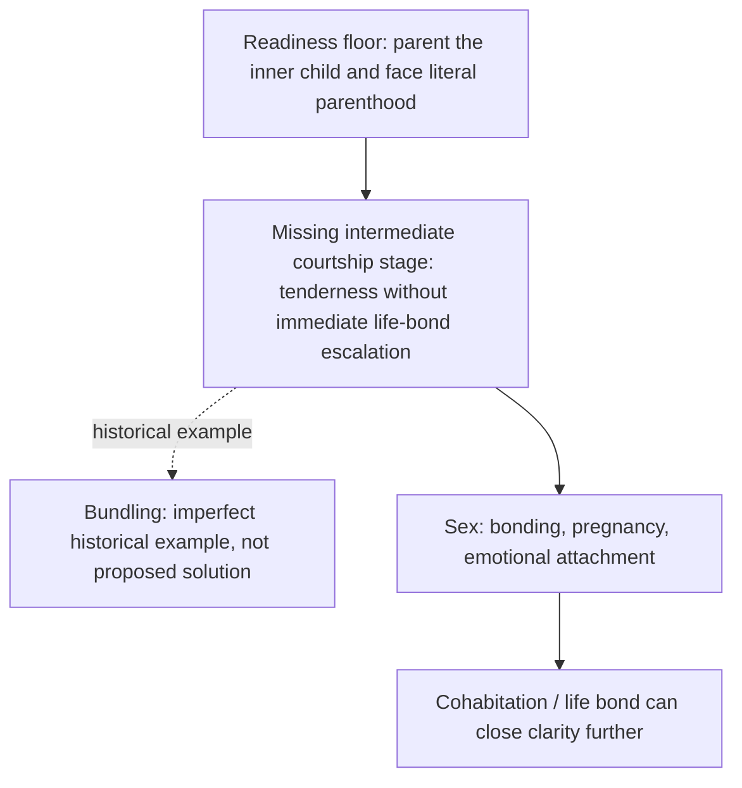

**Control:** `Nobody has to be completely healed` does not weaken the floor. Personal standards vary only above the stated minimum. Bundling is illustrative only; the article does not claim it caused historical pregnancy rates or should be revived.

## Idealization -> healthy-adult evidence -> flaws -> crucible

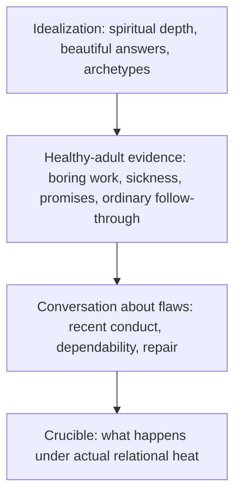

**Control:** spiritual depth may be real without establishing dependability. The bridge creates the question; `The conversation about flaws` remains the practical examination and the Crucible remains the stress test.

## Crucible: mutual activation versus coercion

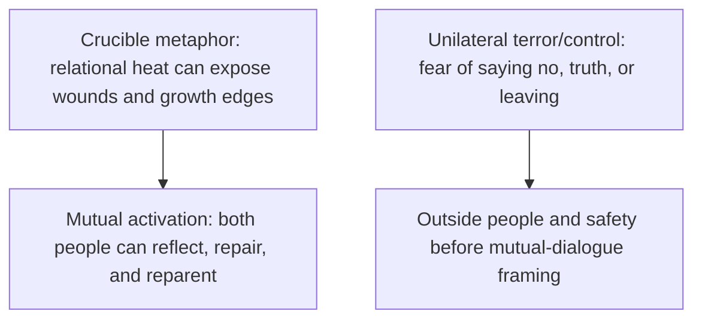

**Control:** coercion is not a hotter version of the mutual Crucible. It exits the mutual-communication path. The article later returns to outside help and unsafe-to-stay exceptions. **Open source-precision issue:** the current introductory description of Schnarch still overgeneralizes `traditional therapy` and frames relationships as `designed to force` growth more teleologically than recovered primary Crucible materials warrant. No claim correction is materialized without Joel's approval.

## Maturity: complementarity versus permanent caregiving

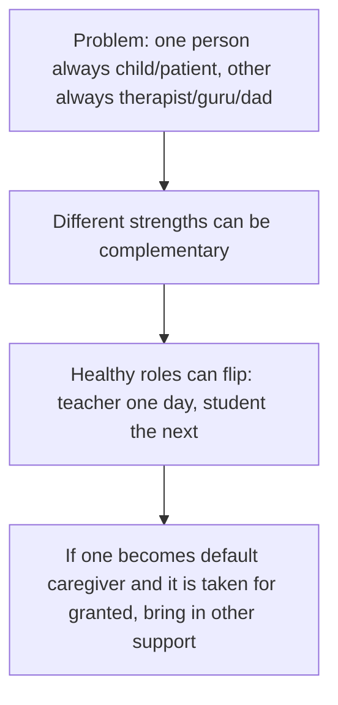

**Control:** the current boundary removes a redundant recap saying partners cannot permanently reparent each other's inner child. That principle already lives earlier in the Crucible. Here the next necessary move after role flexibility is the consequence when flexibility disappears.

## Primal attraction: restored owner subsection route

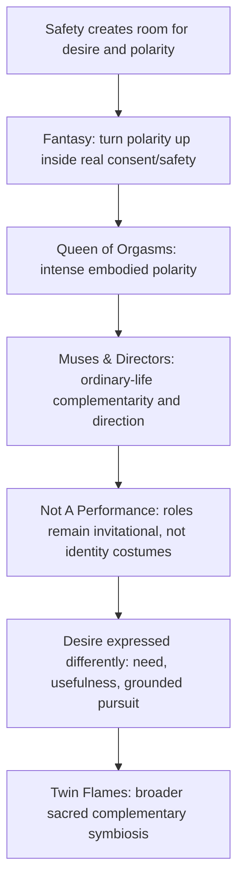

**Control:** this is the recovered direct-owner/no-yellow subsection order. The current reconstruction had drifted to Muses → Desire → Not A Performance → Fantasy → Queen. The current 18,705-word boundary restores owner order while retaining the exact current prose in every subsection. The historical `What I'm Not Saying` caveat is not duplicated here because its unique couple-needs-community function is already carried once by `Two Pillars Don't Hold The Roof Up` after the Twin Flames branch.

**Open source-precision issue:** the Queen paragraph accurately points to Komisaruk/Whipple evidence for vaginal-cervical sensation/orgasm and a vagus-mediated spinal-cord-bypass pathway, but the owner's sentence `That laboratory evidence establishes the uniqueness of the phenomenon` is broader/vaguer than the experiment itself. No claim-scope change is materialized without Joel's approval.

## Labels -> shared meaning -> agreements -> vows

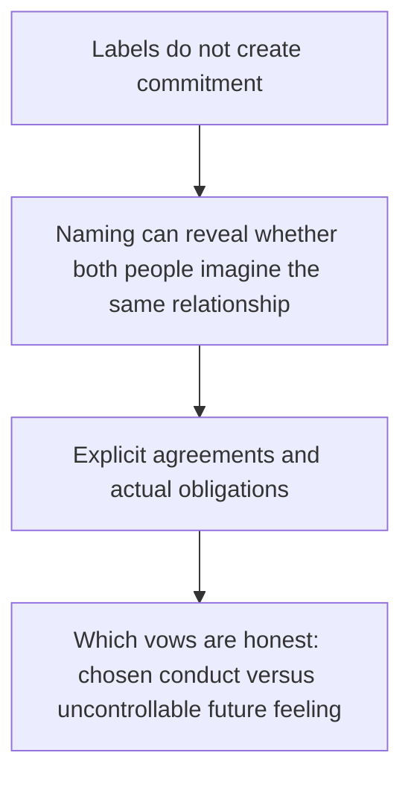

**Control:** refusing a label does not erase responsibility. Naming also does not manufacture relational depth. The vows section already contained the action-versus-feeling distinction; the heading now matches it.

## Community: seed -> primary home -> applications

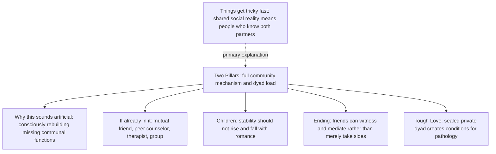

**Control:** the early seed does not repeat Two Pillars. It only establishes the meaning of shared reality before later sections rely on it.

## Psychedelic intimacy -> warning -> state-dependent learning -> sober evidence

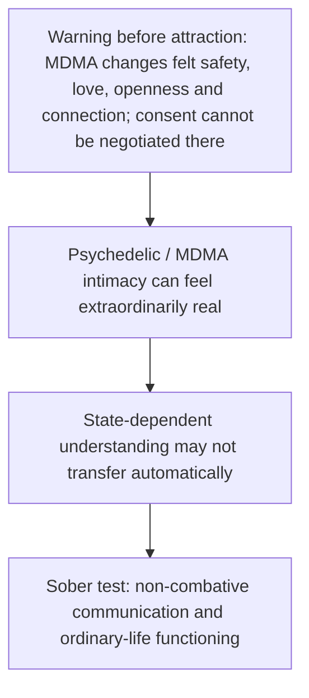

**Control:** the warning appears before the positive possibilities. The section does not offer an imagined safe procedure for getting high and beginning a relationship. The later Key/iboga and MDMA-party material tests whether intimacy survives ordinary sober life.

## Honesty / privacy / timing thread

No new generic framework was inserted because the continuous article already establishes the needed distinctions in place:

- talk before sex and disclose what is known/unknown;
- privacy can constrain what is told to friends;
- separate confidants can create one-sided echo chambers;
- labels and agreements establish shared meaning;
- excess honesty can itself cause damage;
- radical honesty should be mutually prioritized rather than imposed;
- later public truth-telling depends on what happened and why disclosure is occurring.

This remains a distributed thread rather than a single doctrinal section.

## Current authority status

- **Opening:** Aug. 15 direct owner-final opening is materialized.
- **Talk:** preserved. Earlier detector-driven rewrite failed badly and is superseded; no current semantic defect justifies another rewrite.
- **Casual/situationship:** prior text remains intact except the Aug. 17 authorized labels/shared-meaning correction. Regression test proves the rest of the section is unchanged after masking that replacement.
- **Should you be in a relationship:** Aug. 17 categorical two-parenthood readiness floor is materialized; later Crucible standards explicitly remain above that minimum.
- **How to find a partner:** sourced bundling example added only as an imperfect historical illustration of the missing intermediate stage.
- **Starting on the right foot:** card-game closeness is explicitly separated from ordinary-life evidence; community has an early shared-reality seed; idealization has an ordinary-dependability bridge.
- **Crucible:** unilateral terror/control remains explicitly outside the mutual-triggering/growth path; Schnarch attribution precision remains open.
- **Maturity:** redundant 43-word reparenting recap removed; complementarity now flows directly into the default-caregiver consequence.
- **Primal attraction:** direct-owner/no-yellow subsection order restored without rewriting the current owner prose. The current red detector windows belonged to the prior 18,748-word order and do not transfer to this boundary.
- **Twin Flames:** preserved as central Joel worldview, not moved to an appendix.
- **Two Pillars:** remains the full explanatory home for community mechanisms, including the caveat historically duplicated inside Primal.
- **Choosing together / vows:** labels → shared meaning → agreements → conduct-versus-feeling vows route is explicit; heading is `Which marriage vows are honest?`.
- **Doing it consciously / Psychedelics:** MDMA warning precedes positive altered-state material; the current 18,748-word GUI boundary classified the full psychedelic region Human/High.
- **If you're already in it:** Bee door passage explicitly preserves that she lied while adding possible mental-illness context; current long-boundary GUI evidence classified it Human/High.
- **Children:** current owner-final co-parenting / stepchildren / Bear / village function is materialized; reconstruction-only child speech is excluded.
- **Ending consciously / After leaving / What I gained:** Aug. 17 owner correction remains materialized; the current 18,748-word GUI boundary classified the long Ending/After leaving region Human/High despite its isolated prior AI/humanizer label.
- **Tough Love / terminal close:** owner-controlled synthesis remains; Bear/Rumi is the only terminal prose before Subscribe.

## Detector evidence and status

The current **18,705-word** reader-visible boundary has not yet been Pangram tested.

The immediately previous exact 18,748-word GUI boundary was tested manually in two Pangram 4.0 halves:

- Part 1: 9,377 words; 94.4% Human / 5.6% AI / 0 assisted.
- Part 2: 9,371 words; 94.1% Human / 5.9% AI / 0 assisted.
- Durable report: `state/ROMANCE-PANGRAM-GUI-18748-2026-08-17.md`.

The prior GUI evidence identified a 43-word maturity recap (now removed), several Primal red blocks (now reordered using recovered owner architecture rather than rewritten), a 97-word Crucible opening that remains open for source-precision correction, a 58-word Medium-confidence Queen evidence sentence that remains open for source precision, and the stable mixed Talk/Casual boundary.

Do not transfer any prior red label to the 18,705-word boundary after topology changed.

The direct Pangram API credential route remains unreliable; the Browserbase/Playwright GUI automation is implemented on a separate tooling branch but is not live-certified until a real persistent Pangram login Context is supplied and smoke-tested.

## Protected placement rules

1. Do not move or delete a section merely because a nearby detector span is red. Check this map and article-wide architecture first.
2. Repeated people/concepts are not duplication when they perform different jobs.
3. Before deleting or relocating prose, identify every job/dependency and destination; orphaned function blocks the edit.
4. New owner-final topology must update this map alongside assembly authority.
5. A mismatch between this map and materialized master is explicit assembly drift, not permission to reinterpret authority.
6. Older surviving source is not automatically current owner-final prose; current owner correction controls. When an explicit owner-final architecture survives and later reconstruction silently changed it, recover the owner architecture before rewriting its prose.
7. A detector segment crossing a heading/authority boundary must be split by article function before rewrite.
8. Do not substitute evidence about **social monogamy** for evidence about **sexual monogamy / sexual exclusivity**.
9. The categorical readiness floor may not be softened into an individualized gradient.
10. The Bee door event remains a lie; explanatory context may not erase the behavior.
11. MDMA warning stays before attractive altered-state material and may not be converted into a supposed safe-use procedure.

## Current next step

Resolve the two claim-scope questions that cannot be silently edited: the Schnarch/Crucible attribution and the Queen-of-Orgasms laboratory-evidence sentence. Then materialize any owner-approved correction, run two literal cold audits, and use the current line-preserved Part 1/Part 2 boundaries for the next Pangram GUI measurement. Do not rewrite direct owner Primal prose solely to chase the prior detector windows.
