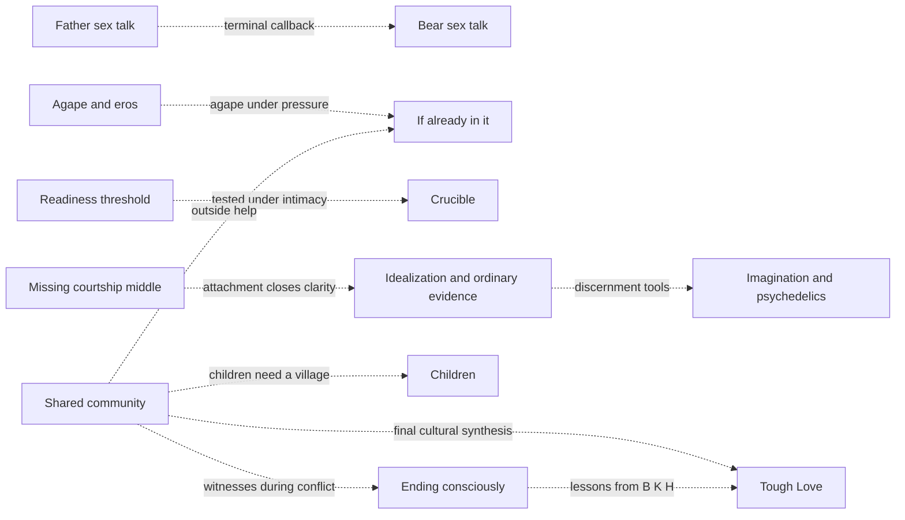
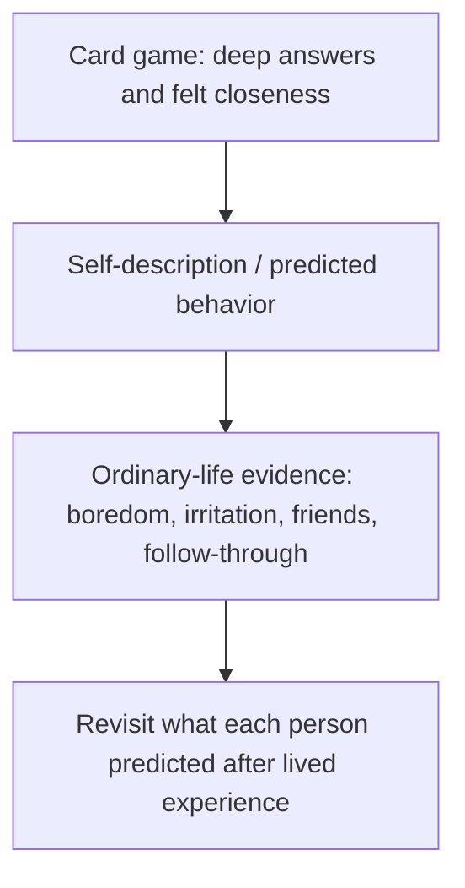
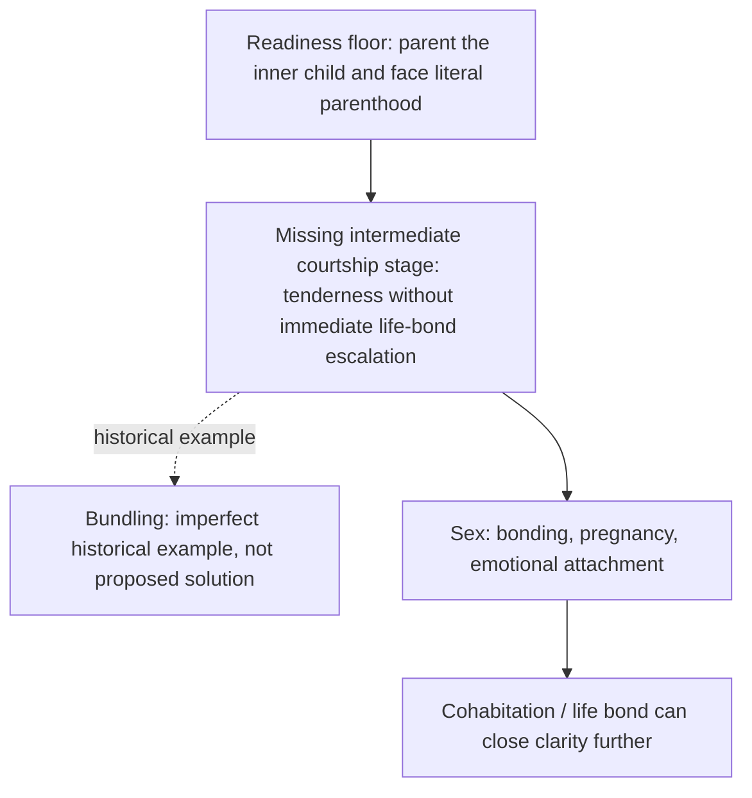
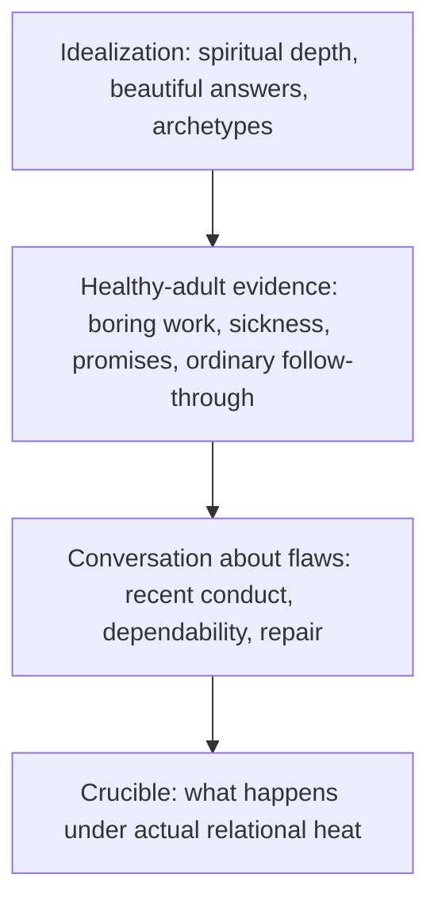
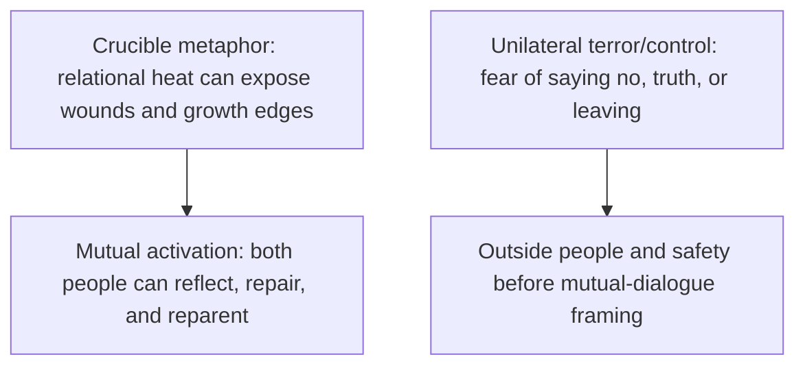
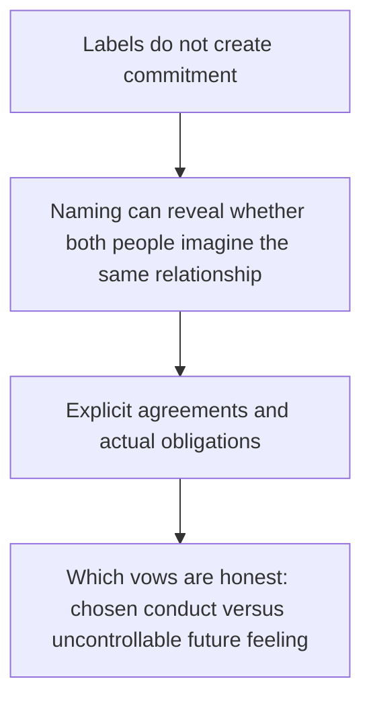
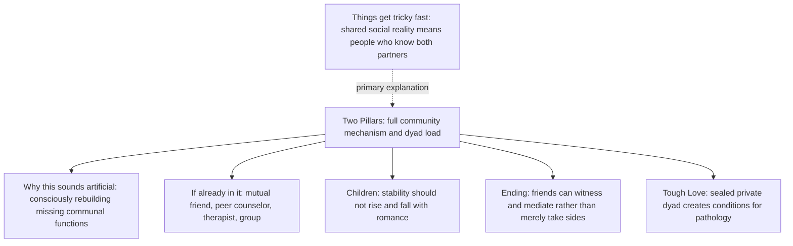
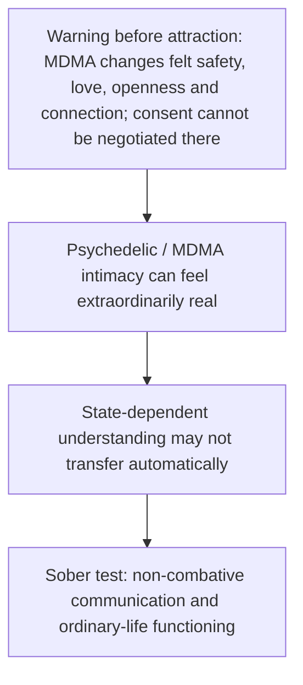

# Romance architecture map

<!-- article-id: romance -->

Indexes the current private Romance reconstruction. This graph is a visual recovery/control surface, not prose authority. Current explicit Joel corrections and the relevant `state/ROMANCE-*.md` records outrank the graph if a conflict is ever found.

Current materialized master: `work/romance-current-assembly/current-master.md` SHA-256 `2d9fdbe0d2406fad2c9778130aeebfeb4a157061fad46597d42817ad876739b1`.
Current reader-visible boundary SHA-256: `7a972576aab329e2afa10278b598596e2acfcc4f6d56a8656785a91df6b5213c` (18,748 words).
Current concept audit: `state/ROMANCE-CONCEPT-SETUP-AUDIT-2026-08-17.md`.
Current whole-article cold audit: `state/ROMANCE-CONCEPT-FLOW-COLD-AUDIT-2026-08-17.md`.
Current prose-change ledger: `state/ROMANCE-CONCEPT-FLOW-PROSE-CHANGE-LEDGER-2026-08-17.md`.
Current task state: `state/ROMANCE-CONCEPT-FLOW-CURRENT-STATE-2026-08-17.md`.

## Article overview

```mermaid
flowchart TD
    opening["Opening: father quote, missing romance curriculum, scope"]
    love["What we mean by love: agape and eros"]
    talk["Talk before sex: making love, honesty, casual sex"]
    should["Should you be in a relationship: categorical readiness and loneliness"]
    find["How to find a partner: community observation and missing courtship middle"]
    starting["Starting on the right foot: discern before attachment closes"]
    crucible["Crucible: intimacy activates wounds; coercion is a separate safety case"]
    primal["Primal attraction: polarity inside safety"]
    twin["Twin Flames: de-ontologize deep connection"]
    pillars["Two Pillars: couple needs shared community"]
    choosing["Choosing together: labels, agreements, vows, exclusivity"]
    conscious["Doing it consciously: imagination and psychedelic integration"]
    already["If already in it: trust, honesty, agape, outside help"]
    children["Children: obligations that survive adult romance"]
    ending["Ending consciously: leave, aftermath, learn from loss"]
    tough["Tough Love: cultural and spiritual synthesis"]
    bear["Bear and Rumi: return to opening and stop"]

    opening --> love --> talk --> should --> find --> starting --> crucible --> primal --> twin --> pillars --> choosing --> conscious --> already --> children --> ending --> tough --> bear
```

## Non-linear dependencies

## Card-game intimacy -> lived evidence

**Control:** the game can produce real closeness and still only establish that the conversation worked. The primary evidence shift is from what someone says about themself to what ordinary life reveals. The later agreements/card-game passage is a callback, not a second primary explanation.

## Readiness -> missing intermediate stage -> entanglement

**Control:** `Nobody has to be completely healed` does not weaken the floor. Personal standards vary only above the stated minimum. Bundling is illustrative only; the article does not claim it caused historical pregnancy rates or should be revived.

## Idealization -> healthy-adult evidence -> flaws -> crucible

**Control:** spiritual depth may be real without establishing dependability. The bridge creates the question; `The conversation about flaws` remains the practical examination and the Crucible remains the stress test.

## Crucible: mutual activation versus coercion

**Control:** coercion is not a hotter version of the mutual Crucible. It exits the mutual-communication path. The article later returns to outside help and unsafe-to-stay exceptions.

## Labels -> shared meaning -> agreements -> vows

**Control:** refusing a label does not erase responsibility. Naming also does not manufacture relational depth. The vows section already contained the action-versus-feeling distinction; the heading now matches it.

## Community: seed -> primary home -> applications

**Control:** the early seed does not repeat Two Pillars. It only establishes the meaning of shared reality before later sections rely on it.

## Psychedelic intimacy -> warning -> state-dependent learning -> sober evidence

**Control:** the warning appears before the positive possibilities. The section does not offer an imagined safe procedure for getting high and beginning a relationship. The later Key/iboga and MDMA-party material tests whether intimacy survives ordinary sober life.

## Honesty / privacy / timing thread

No new generic framework was inserted because the continuous article already establishes the needed distinctions in place:

- talk before sex and disclose what is known/unknown;
- privacy can constrain what is told to friends;
- separate confidants can create one-sided echo chambers;
- labels and agreements establish shared meaning;
- excess honesty can itself cause damage;
- radical honesty should be mutually prioritized rather than imposed;
- later public truth-telling depends on what happened and why disclosure is occurring.

This remains a distributed thread rather than a single doctrinal section.

## Current authority status

- **Opening:** Aug. 15 direct owner-final opening is materialized.
- **Talk:** preserved. Earlier detector-driven rewrite failed badly and is superseded; no current semantic defect justifies another rewrite.
- **Casual/situationship:** prior text remains intact except the Aug. 17 authorized labels/shared-meaning correction. Regression test proves the rest of the section is unchanged after masking that replacement.
- **Should you be in a relationship:** Aug. 17 categorical two-parenthood readiness floor is materialized; later Crucible standards explicitly remain above that minimum.
- **How to find a partner:** sourced bundling example added only as an imperfect historical illustration of the missing intermediate stage.
- **Starting on the right foot:** card-game closeness is now explicitly separated from ordinary-life evidence; community gets an early shared-reality seed; idealization gets an ordinary-dependability bridge.
- **Crucible:** unilateral terror/control is now explicitly outside the mutual-triggering/growth path.
- **Primal attraction:** manually owner-corrected architecture and claims remain. Current detector uncertainty is not by itself a semantic defect.
- **Twin Flames:** preserved as central Joel worldview, not moved to an appendix.
- **Two Pillars:** remains the full explanatory home for community mechanisms.
- **Choosing together / vows:** labels -> shared meaning -> agreements -> conduct-versus-feeling vows route is explicit; heading is now `Which marriage vows are honest?`.
- **Doing it consciously / Psychedelics:** MDMA warning now precedes positive altered-state material; state-dependent-learning and sober-transfer test remain intact.
- **If you're already in it:** Bee door passage explicitly preserves that she lied while adding possible mental-illness context; existing honesty/privacy qualification remains.
- **Children:** current owner-final co-parenting / stepchildren / Bear / village function is materialized; reconstruction-only child speech is excluded.
- **Ending consciously / After leaving / What I gained:** Aug. 17 owner correction to After leaving is materialized; self-contribution and ex-perspective/internal-conflict route preserved without automatic demonization.
- **Tough Love / terminal close:** owner-controlled synthesis remains; Bear/Rumi is the only terminal prose before Subscribe.

## Detector evidence and status

The current 18,748-word reader-visible boundary has **not** been Pangram-certified.

Manual Pangram 4.0 PDFs supplied by Joel correspond to the immediately earlier 18,248-word split boundary:

- Part 1: 11,506 words, 92.5% Human / 7.5% AI, with High-confidence block localization.
- Part 2: 6,742 words, 98.9% Human / 1.1% AI, with High-confidence block localization.
- A separate 574-word Primal diagnostic returned 54% AI / 46% Human and exposed alternating red/green blocks.

These GUI PDFs are useful localization evidence but are not classifications of the current hash.

The repository-secret API route currently reaches Pangram but POST submission fails with HTTP 401 `Invalid API key`. Joel has contacted Pangram support. Do not launch duplicate paid work while this credential issue remains unresolved.

Historical whole-article Pangram records remain evidence for their exact prior hashes only; they do not transfer to this boundary.

## Protected placement rules

1. Do not move or delete a section merely because a nearby detector span is red. Check this map and article-wide architecture first.
2. Repeated people/concepts are not duplication when they perform different jobs.
3. Before deleting or relocating prose, identify every job/dependency and destination; orphaned function blocks the edit.
4. New owner-final topology must update this map alongside assembly authority.
5. A mismatch between this map and materialized master is explicit assembly drift, not permission to reinterpret authority.
6. Older surviving source is not automatically current owner-final prose; current owner correction controls.
7. A detector segment crossing a heading/authority boundary must be split by article function before rewrite.
8. Do not substitute evidence about **social monogamy** for evidence about **sexual monogamy / sexual exclusivity**.
9. The categorical readiness floor may not be softened into an individualized gradient.
10. The Bee door event remains a lie; explanatory context may not erase the behavior.
11. MDMA warning stays before attractive altered-state material and may not be converted into a supposed safe-use procedure.

## Current next step

Use the manual Pangram GUI only on the stable current boundary while the API key problem is unresolved. Prefer full current Part 1 / Part 2 boundaries for article-level localization; use focused PDFs only to understand a flagged region. Do not rewrite Primal or Talk unless detector evidence and an independent semantic/coherence review identify a faithful repair.